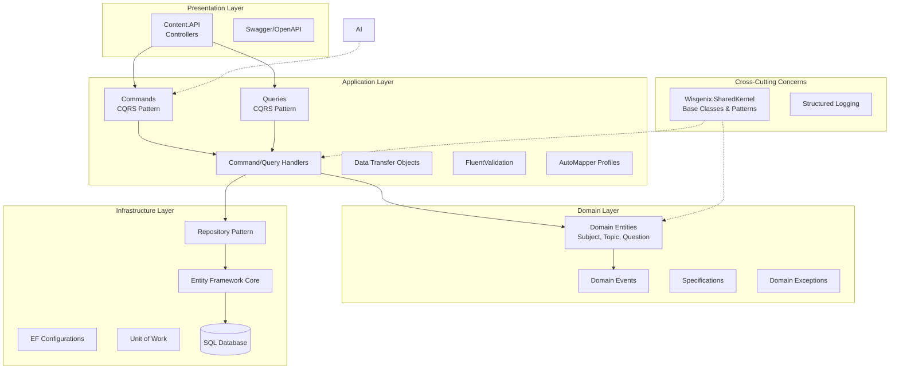
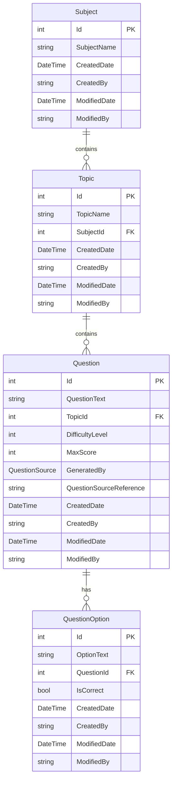

# Wisgenix - Architecture Overview

## High-Level Architecture

## Clean Architecture Layers

### 1. **Presentation Layer** (`Content.API`)
- RESTful API controllers
- Request/Response handling
- Authentication & Authorization
- Swagger documentation

### 2. **Application Layer** (`Content.Application`)
- CQRS implementation with MediatR
- Command and Query handlers
- Data validation with FluentValidation
- Object mapping with AutoMapper
- Business orchestration

### 3. **Domain Layer** (`Content.Domain`)
- Rich domain entities with business logic
- Domain events for side effects
- Specifications for complex queries
- Domain exceptions
- Business rules enforcement

### 4. **Infrastructure Layer** (`Content.Infrastructure`)
- Entity Framework Core implementation
- Repository pattern
- Unit of Work pattern
- Database configurations
- External service integrations

## Domain Model

