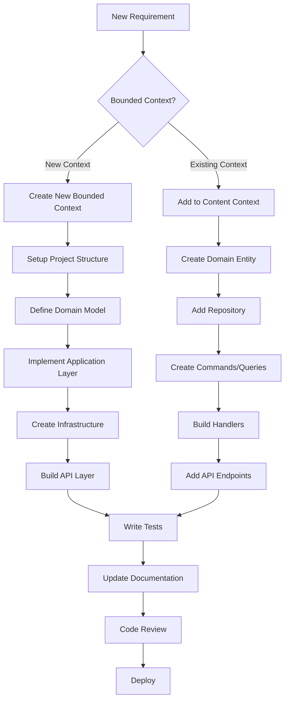

# Wisgenix - Developer Guide

## Overview

This guide provides step-by-step instructions for developers working on the Wisgenix Content Management System. It covers adding new bounded contexts, creating new entities within existing contexts, and following established patterns and conventions.

## Development Workflow



## Part 1: Adding New Bounded Context

### Step 1: Project Structure Setup

Create the following project structure for a new bounded context (e.g., `Assessment`):

```
src/
├── Assessment.Domain/
├── Assessment.Application/
├── Assessment.Infrastructure/
├── Assessment.API/
└── Assessment.Tests/
```

#### 1.1 Create Domain Project
```bash
# Navigate to src folder
cd src

# Create domain project
dotnet new classlib -n Assessment.Domain -f net9.0
cd Assessment.Domain

# Add SharedKernel reference
dotnet add reference ../Wisgenix.SharedKernel/Wisgenix.SharedKernel.csproj

# Create folder structure
mkdir Entities ValueObjects Events Repositories Services Exceptions Specifications
```

#### 1.2 Create Application Project
```bash
cd ../
dotnet new classlib -n Assessment.Application -f net9.0
cd Assessment.Application

# Add references
dotnet add reference ../Wisgenix.SharedKernel/Wisgenix.SharedKernel.csproj
dotnet add reference ../Assessment.Domain/Assessment.Domain.csproj

# Add NuGet packages
dotnet add package MediatR
dotnet add package FluentValidation
dotnet add package AutoMapper

# Create folder structure
mkdir Commands Queries Handlers DTOs Validators Mappings Services
```

#### 1.3 Create Infrastructure Project
```bash
cd ../
dotnet new classlib -n Assessment.Infrastructure -f net9.0
cd Assessment.Infrastructure

# Add references
dotnet add reference ../Wisgenix.SharedKernel/Wisgenix.SharedKernel.csproj
dotnet add reference ../Assessment.Domain/Assessment.Domain.csproj
dotnet add reference ../Assessment.Application/Assessment.Application.csproj

# Add NuGet packages
dotnet add package Microsoft.EntityFrameworkCore
dotnet add package Microsoft.EntityFrameworkCore.SqlServer

# Create folder structure
mkdir Data Repositories Configurations Services
```

#### 1.4 Create API Project
```bash
cd ../
dotnet new webapi -n Assessment.API -f net9.0
cd Assessment.API

# Add references
dotnet add reference ../Wisgenix.SharedKernel/Wisgenix.SharedKernel.csproj
dotnet add reference ../Assessment.Domain/Assessment.Domain.csproj
dotnet add reference ../Assessment.Application/Assessment.Application.csproj
dotnet add reference ../Assessment.Infrastructure/Assessment.Infrastructure.csproj

# Create folder structure
mkdir Controllers Middleware Models
```

### Step 2: Domain Layer Implementation

#### 2.1 Create Domain Entity
```csharp
// Assessment.Domain/Entities/Assessment.cs
using Wisgenix.SharedKernel.Domain;
using Assessment.Domain.ValueObjects;
using Assessment.Domain.Events;

namespace Assessment.Domain.Entities;

public class Assessment : AuditableEntity
{
    private readonly List<AssessmentQuestion> _questions = new();

    public AssessmentTitle Title { get; private set; }
    public AssessmentDescription Description { get; private set; }
    public TimeSpan Duration { get; private set; }
    public int MaxScore { get; private set; }
    public AssessmentStatus Status { get; private set; }
    public IReadOnlyCollection<AssessmentQuestion> Questions => _questions.AsReadOnly();

    private Assessment() { } // EF Constructor

    public Assessment(string title, string description, TimeSpan duration)
    {
        Title = AssessmentTitle.Create(title);
        Description = AssessmentDescription.Create(description);
        Duration = duration;
        Status = AssessmentStatus.Draft;
        MaxScore = 0;

        AddDomainEvent(new AssessmentCreatedEvent(Id, Title.Value));
    }

    public void UpdateTitle(string title)
    {
        var oldTitle = Title.Value;
        Title = AssessmentTitle.Create(title);
        AddDomainEvent(new AssessmentTitleUpdatedEvent(Id, oldTitle, Title.Value));
    }

    public void AddQuestion(int questionId, int score)
    {
        if (_questions.Any(q => q.QuestionId == questionId))
            throw new BusinessRuleViolationException("Question already exists in assessment");

        var assessmentQuestion = new AssessmentQuestion(Id, questionId, score);
        _questions.Add(assessmentQuestion);
        MaxScore += score;

        AddDomainEvent(new QuestionAddedToAssessmentEvent(Id, questionId, score));
    }

    public void Publish()
    {
        if (!_questions.Any())
            throw new BusinessRuleViolationException("Cannot publish assessment without questions");

        Status = AssessmentStatus.Published;
        AddDomainEvent(new AssessmentPublishedEvent(Id, Title.Value));
    }
}
```

#### 2.2 Create Value Objects
```csharp
// Assessment.Domain/ValueObjects/AssessmentTitle.cs
using Wisgenix.SharedKernel.Domain;

namespace Assessment.Domain.ValueObjects;

public class AssessmentTitle : ValueObject
{
    public const int MaxLength = 200;
    public string Value { get; private set; }

    private AssessmentTitle(string value)
    {
        Value = value;
    }

    public static AssessmentTitle Create(string value)
    {
        if (string.IsNullOrWhiteSpace(value))
            throw new DomainValidationException("Assessment title cannot be empty");

        if (value.Length > MaxLength)
            throw new DomainValidationException($"Assessment title cannot exceed {MaxLength} characters");

        return new AssessmentTitle(value.Trim());
    }

    protected override IEnumerable<object> GetEqualityComponents()
    {
        yield return Value;
    }

    public static implicit operator string(AssessmentTitle title) => title.Value;
}
```

#### 2.3 Create Domain Events
```csharp
// Assessment.Domain/Events/AssessmentCreatedEvent.cs
using Wisgenix.SharedKernel.Domain;

namespace Assessment.Domain.Events;

public class AssessmentCreatedEvent : BaseDomainEvent
{
    public int AssessmentId { get; }
    public string AssessmentTitle { get; }

    public AssessmentCreatedEvent(int assessmentId, string assessmentTitle)
    {
        AssessmentId = assessmentId;
        AssessmentTitle = assessmentTitle;
    }
}
```

#### 2.4 Create Repository Interface
```csharp
// Assessment.Domain/Repositories/IAssessmentRepository.cs
using Wisgenix.SharedKernel.Application;
using Assessment.Domain.Entities;

namespace Assessment.Domain.Repositories;

public interface IAssessmentRepository : IRepository<Assessment>
{
    Task<List<Assessment>> GetByStatusAsync(AssessmentStatus status, CancellationToken cancellationToken = default);
    Task<Assessment?> GetByTitleAsync(string title, CancellationToken cancellationToken = default);
    Task<List<Assessment>> GetPublishedAssessmentsAsync(CancellationToken cancellationToken = default);
}
```

### Step 3: Application Layer Implementation

#### 3.1 Create Commands and Queries
```csharp
// Assessment.Application/Commands/CreateAssessmentCommand.cs
using MediatR;
using Assessment.Application.DTOs;

namespace Assessment.Application.Commands;

public record CreateAssessmentCommand(
    string Title,
    string Description,
    TimeSpan Duration
) : IRequest<GetAssessmentResponse>;
```

#### 3.2 Create Command Handlers
```csharp
// Assessment.Application/Handlers/CreateAssessmentHandler.cs
using MediatR;
using AutoMapper;
using Assessment.Application.Commands;
using Assessment.Application.DTOs;
using Assessment.Domain.Entities;
using Assessment.Domain.Repositories;
using Wisgenix.SharedKernel.Application;

namespace Assessment.Application.Handlers;

public class CreateAssessmentHandler : IRequestHandler<CreateAssessmentCommand, GetAssessmentResponse>
{
    private readonly IAssessmentRepository _repository;
    private readonly IUnitOfWork _unitOfWork;
    private readonly IMapper _mapper;
    private readonly ILogger<CreateAssessmentHandler> _logger;

    public CreateAssessmentHandler(
        IAssessmentRepository repository,
        IUnitOfWork unitOfWork,
        IMapper mapper,
        ILogger<CreateAssessmentHandler> logger)
    {
        _repository = repository;
        _unitOfWork = unitOfWork;
        _mapper = mapper;
        _logger = logger;
    }

    public async Task<GetAssessmentResponse> Handle(CreateAssessmentCommand request, CancellationToken cancellationToken)
    {
        _logger.LogInformation("Creating assessment with title {Title}", request.Title);

        // Check for duplicate title
        var existingAssessment = await _repository.GetByTitleAsync(request.Title, cancellationToken);
        if (existingAssessment != null)
            throw new DuplicateEntityException("Assessment with this title already exists");

        // Create domain entity
        var assessment = new Assessment.Domain.Entities.Assessment(
            request.Title,
            request.Description,
            request.Duration);

        // Save to repository
        await _repository.AddAsync(assessment, cancellationToken);
        await _unitOfWork.SaveChangesAsync(cancellationToken);

        _logger.LogInformation("Assessment created with ID {AssessmentId}", assessment.Id);

        return _mapper.Map<GetAssessmentResponse>(assessment);
    }
}
```

#### 3.3 Create DTOs
```csharp
// Assessment.Application/DTOs/GetAssessmentResponse.cs
namespace Assessment.Application.DTOs;

public class GetAssessmentResponse
{
    public int Id { get; set; }
    public string Title { get; set; } = string.Empty;
    public string Description { get; set; } = string.Empty;
    public TimeSpan Duration { get; set; }
    public int MaxScore { get; set; }
    public string Status { get; set; } = string.Empty;
    public int QuestionCount { get; set; }
    public DateTime CreatedDate { get; set; }
    public string CreatedBy { get; set; } = string.Empty;
}

public class AddAssessmentRequest
{
    public string Title { get; set; } = string.Empty;
    public string Description { get; set; } = string.Empty;
    public int DurationMinutes { get; set; }
}
```

#### 3.4 Create Validators
```csharp
// Assessment.Application/Validators/AssessmentValidators.cs
using FluentValidation;
using Assessment.Application.DTOs;
using Assessment.Domain.ValueObjects;

namespace Assessment.Application.Validators;

public class AddAssessmentRequestValidator : AbstractValidator<AddAssessmentRequest>
{
    public AddAssessmentRequestValidator()
    {
        RuleFor(x => x.Title)
            .NotEmpty()
            .WithMessage("Assessment title is required")
            .MaximumLength(AssessmentTitle.MaxLength)
            .WithMessage($"Assessment title must not exceed {AssessmentTitle.MaxLength} characters");

        RuleFor(x => x.Description)
            .NotEmpty()
            .WithMessage("Assessment description is required")
            .MaximumLength(AssessmentDescription.MaxLength)
            .WithMessage($"Assessment description must not exceed {AssessmentDescription.MaxLength} characters");

        RuleFor(x => x.DurationMinutes)
            .GreaterThan(0)
            .WithMessage("Duration must be greater than 0 minutes")
            .LessThanOrEqualTo(480)
            .WithMessage("Duration cannot exceed 8 hours");
    }
}
```

### Step 4: Infrastructure Layer Implementation

#### 4.1 Create Repository Implementation
```csharp
// Assessment.Infrastructure/Repositories/AssessmentRepository.cs
using Microsoft.EntityFrameworkCore;
using Assessment.Domain.Entities;
using Assessment.Domain.Repositories;
using Assessment.Infrastructure.Data;

namespace Assessment.Infrastructure.Repositories;

public class AssessmentRepository : IAssessmentRepository
{
    private readonly AssessmentDbContext _context;

    public AssessmentRepository(AssessmentDbContext context)
    {
        _context = context;
    }

    public async Task<Assessment.Domain.Entities.Assessment?> GetByIdAsync(int id, CancellationToken cancellationToken = default)
    {
        return await _context.Assessments
            .Include(a => a.Questions)
            .FirstOrDefaultAsync(a => a.Id == id, cancellationToken);
    }

    public async Task<List<Assessment.Domain.Entities.Assessment>> GetAllAsync(CancellationToken cancellationToken = default)
    {
        return await _context.Assessments
            .Include(a => a.Questions)
            .ToListAsync(cancellationToken);
    }

    public async Task<Assessment.Domain.Entities.Assessment> AddAsync(Assessment.Domain.Entities.Assessment entity, CancellationToken cancellationToken = default)
    {
        _context.Assessments.Add(entity);
        return entity;
    }

    // Implement other methods...
}
```

#### 4.2 Create DbContext
```csharp
// Assessment.Infrastructure/Data/AssessmentDbContext.cs
using Microsoft.EntityFrameworkCore;
using Assessment.Domain.Entities;
using Assessment.Infrastructure.Configurations;

namespace Assessment.Infrastructure.Data;

public class AssessmentDbContext : DbContext
{
    public DbSet<Assessment.Domain.Entities.Assessment> Assessments { get; set; }
    public DbSet<AssessmentQuestion> AssessmentQuestions { get; set; }

    public AssessmentDbContext(DbContextOptions<AssessmentDbContext> options) : base(options)
    {
    }

    protected override void OnModelCreating(ModelBuilder modelBuilder)
    {
        modelBuilder.ApplyConfiguration(new AssessmentConfiguration());
        modelBuilder.ApplyConfiguration(new AssessmentQuestionConfiguration());
        
        base.OnModelCreating(modelBuilder);
    }
}
```

### Step 5: API Layer Implementation

#### 5.1 Create Controller
```csharp
// Assessment.API/Controllers/AssessmentsController.cs
using Microsoft.AspNetCore.Mvc;
using MediatR;
using Assessment.Application.Commands;
using Assessment.Application.Queries;
using Assessment.Application.DTOs;

namespace Assessment.API.Controllers;

[ApiController]
[Route("api/assessment/[controller]")]
public class AssessmentsController : ControllerBase
{
    private readonly IMediator _mediator;
    private readonly ILogger<AssessmentsController> _logger;

    public AssessmentsController(IMediator mediator, ILogger<AssessmentsController> logger)
    {
        _mediator = mediator;
        _logger = logger;
    }

    [HttpPost]
    public async Task<ActionResult<GetAssessmentResponse>> CreateAssessment([FromBody] AddAssessmentRequest request)
    {
        var command = new CreateAssessmentCommand(
            request.Title,
            request.Description,
            TimeSpan.FromMinutes(request.DurationMinutes));

        var result = await _mediator.Send(command);
        return CreatedAtAction(nameof(GetAssessment), new { id = result.Id }, result);
    }

    [HttpGet("{id}")]
    public async Task<ActionResult<GetAssessmentResponse>> GetAssessment(int id)
    {
        var query = new GetAssessmentQuery(id);
        var result = await _mediator.Send(query);
        return Ok(result);
    }
}
```

## Part 2: Adding New Entity to Content Context

### Step 1: Create Domain Entity

```csharp
// Content.Domain/Entities/QuestionCategory.cs
using Wisgenix.SharedKernel.Domain;
using Content.Domain.ValueObjects;
using Content.Domain.Events;

namespace Content.Domain.Entities;

public class QuestionCategory : AuditableEntity
{
    private readonly List<Question> _questions = new();

    public CategoryName CategoryName { get; private set; }
    public CategoryDescription Description { get; private set; }
    public CategoryColor Color { get; private set; }
    public IReadOnlyCollection<Question> Questions => _questions.AsReadOnly();

    private QuestionCategory() { } // EF Constructor

    public QuestionCategory(string categoryName, string description, string color)
    {
        CategoryName = CategoryName.Create(categoryName);
        Description = CategoryDescription.Create(description);
        Color = CategoryColor.Create(color);

        AddDomainEvent(new QuestionCategoryCreatedEvent(Id, CategoryName.Value));
    }

    public void UpdateCategoryName(string categoryName)
    {
        var oldName = CategoryName.Value;
        CategoryName = CategoryName.Create(categoryName);
        AddDomainEvent(new QuestionCategoryUpdatedEvent(Id, oldName, CategoryName.Value));
    }

    public void AssignToQuestion(Question question)
    {
        if (_questions.Contains(question))
            throw new BusinessRuleViolationException("Question is already assigned to this category");

        _questions.Add(question);
        AddDomainEvent(new QuestionAssignedToCategoryEvent(Id, question.Id));
    }
}
```

### Step 2: Add to Existing Infrastructure

#### 2.1 Update DbContext
```csharp
// Content.Infrastructure/Data/ContentDbContext.cs
public class ContentDbContext : DbContext
{
    public DbSet<Subject> Subjects { get; set; }
    public DbSet<Topic> Topics { get; set; }
    public DbSet<Question> Questions { get; set; }
    public DbSet<QuestionOption> QuestionOptions { get; set; }
    public DbSet<QuestionCategory> QuestionCategories { get; set; } // Add this line

    protected override void OnModelCreating(ModelBuilder modelBuilder)
    {
        // Existing configurations...
        modelBuilder.ApplyConfiguration(new QuestionCategoryConfiguration()); // Add this line
        
        base.OnModelCreating(modelBuilder);
    }
}
```

#### 2.2 Create EF Configuration
```csharp
// Content.Infrastructure/Configurations/QuestionCategoryConfiguration.cs
using Microsoft.EntityFrameworkCore;
using Microsoft.EntityFrameworkCore.Metadata.Builders;
using Content.Domain.Entities;

namespace Content.Infrastructure.Configurations;

public class QuestionCategoryConfiguration : IEntityTypeConfiguration<QuestionCategory>
{
    public void Configure(EntityTypeBuilder<QuestionCategory> builder)
    {
        builder.ToTable("QuestionCategories");

        builder.HasKey(qc => qc.Id);

        builder.Property(qc => qc.CategoryName)
            .HasConversion(
                categoryName => categoryName.Value,
                value => CategoryName.Create(value))
            .HasMaxLength(CategoryName.MaxLength)
            .IsRequired();

        builder.Property(qc => qc.Description)
            .HasConversion(
                description => description.Value,
                value => CategoryDescription.Create(value))
            .HasMaxLength(CategoryDescription.MaxLength);

        builder.Property(qc => qc.Color)
            .HasConversion(
                color => color.Value,
                value => CategoryColor.Create(value))
            .HasMaxLength(7); // #RRGGBB format

        // Configure audit fields
        builder.Property(qc => qc.CreatedDate).IsRequired();
        builder.Property(qc => qc.CreatedBy).HasMaxLength(100).IsRequired();
        builder.Property(qc => qc.ModifiedDate).IsRequired();
        builder.Property(qc => qc.ModifiedBy).HasMaxLength(100).IsRequired();

        // Configure relationships
        builder.HasMany(qc => qc.Questions)
            .WithOne(q => q.Category)
            .HasForeignKey(q => q.CategoryId)
            .OnDelete(DeleteBehavior.SetNull);

        // Indexes
        builder.HasIndex(qc => qc.CategoryName).IsUnique();
    }
}
```

### Step 3: Create Migration
```bash
# Navigate to the API project
cd src/Content.API

# Create migration
dotnet ef migrations add AddQuestionCategory --project ../Content.Infrastructure

# Update database
dotnet ef database update --project ../Content.Infrastructure
```

### Step 4: Add Application Layer Components

#### 4.1 Create Commands/Queries
```csharp
// Content.Application/Commands/CreateQuestionCategoryCommand.cs
using MediatR;
using Content.Application.DTOs;

namespace Content.Application.Commands;

public record CreateQuestionCategoryCommand(
    string CategoryName,
    string Description,
    string Color
) : IRequest<GetQuestionCategoryResponse>;
```

#### 4.2 Update AutoMapper Profile
```csharp
// Content.Application/Mappings/ContentMappingProfile.cs
public class ContentMappingProfile : Profile
{
    public ContentMappingProfile()
    {
        // Existing mappings...

        // QuestionCategory mappings
        CreateMap<QuestionCategory, GetQuestionCategoryResponse>()
            .ForMember(dest => dest.CategoryName, opt => opt.MapFrom(src => src.CategoryName.Value))
            .ForMember(dest => dest.Description, opt => opt.MapFrom(src => src.Description.Value))
            .ForMember(dest => dest.Color, opt => opt.MapFrom(src => src.Color.Value))
            .ForMember(dest => dest.QuestionCount, opt => opt.MapFrom(src => src.Questions.Count));

        CreateMap<AddQuestionCategoryRequest, QuestionCategory>()
            .ConstructUsing(src => new QuestionCategory(src.CategoryName, src.Description, src.Color));
    }
}
```

### Step 5: Add API Endpoints

#### 5.1 Update Existing Controller or Create New One
```csharp
// Content.API/Controllers/QuestionCategoriesController.cs
using Microsoft.AspNetCore.Mvc;
using MediatR;
using Content.Application.Commands;
using Content.Application.Queries;
using Content.Application.DTOs;

namespace Content.API.Controllers;

[ApiController]
[Route("api/content/question-categories")]
public class QuestionCategoriesController : ControllerBase
{
    private readonly IMediator _mediator;

    public QuestionCategoriesController(IMediator mediator)
    {
        _mediator = mediator;
    }

    [HttpPost]
    public async Task<ActionResult<GetQuestionCategoryResponse>> CreateQuestionCategory([FromBody] AddQuestionCategoryRequest request)
    {
        var command = new CreateQuestionCategoryCommand(request.CategoryName, request.Description, request.Color);
        var result = await _mediator.Send(command);
        return CreatedAtAction(nameof(GetQuestionCategory), new { id = result.Id }, result);
    }

    [HttpGet("{id}")]
    public async Task<ActionResult<GetQuestionCategoryResponse>> GetQuestionCategory(int id)
    {
        var query = new GetQuestionCategoryQuery(id);
        var result = await _mediator.Send(query);
        return Ok(result);
    }
}
```

## Testing Strategy

### Unit Tests
```csharp
// Assessment.Tests/Domain/AssessmentTests.cs
using Xunit;
using Assessment.Domain.Entities;
using Wisgenix.SharedKernel.Domain.Exceptions;

namespace Assessment.Tests.Domain;

public class AssessmentTests
{
    [Fact]
    public void CreateAssessment_WithValidData_ShouldCreateSuccessfully()
    {
        // Arrange
        var title = "Math Assessment";
        var description = "Basic math skills assessment";
        var duration = TimeSpan.FromMinutes(60);

        // Act
        var assessment = new Assessment.Domain.Entities.Assessment(title, description, duration);

        // Assert
        Assert.Equal(title, assessment.Title.Value);
        Assert.Equal(description, assessment.Description.Value);
        Assert.Equal(duration, assessment.Duration);
        Assert.Equal(AssessmentStatus.Draft, assessment.Status);
        Assert.Single(assessment.DomainEvents);
    }

    [Fact]
    public void CreateAssessment_WithEmptyTitle_ShouldThrowException()
    {
        // Arrange
        var title = "";
        var description = "Basic math skills assessment";
        var duration = TimeSpan.FromMinutes(60);

        // Act & Assert
        Assert.Throws<DomainValidationException>(() => 
            new Assessment.Domain.Entities.Assessment(title, description, duration));
    }
}
```

## Best Practices Checklist

### Domain Layer
- [ ] Entities inherit from `AuditableEntity`
- [ ] Value objects used for validated properties
- [ ] Domain events raised for significant operations
- [ ] Business rules enforced in domain entities
- [ ] Repository interfaces defined in domain

### Application Layer
- [ ] CQRS pattern implemented with MediatR
- [ ] FluentValidation for input validation
- [ ] AutoMapper for object mapping
- [ ] Handlers are focused and single-purpose
- [ ] DTOs used for external communication

### Infrastructure Layer
- [ ] Repository pattern implemented
- [ ] EF Core configurations created
- [ ] Migrations generated and applied
- [ ] Unit of Work pattern used

### API Layer
- [ ] Controllers are thin and focused
- [ ] Proper HTTP status codes returned
- [ ] Global exception handling implemented
- [ ] OpenAPI documentation updated

### Testing
- [ ] Unit tests for domain logic
- [ ] Integration tests for repositories
- [ ] API tests for endpoints
- [ ] Test coverage > 80%

This developer guide provides a comprehensive approach to extending the Wisgenix system while maintaining consistency and following established patterns.