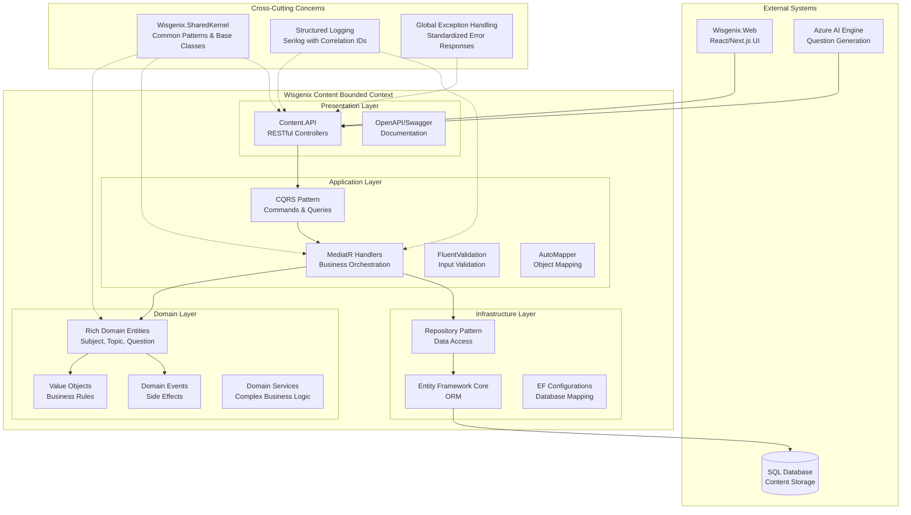
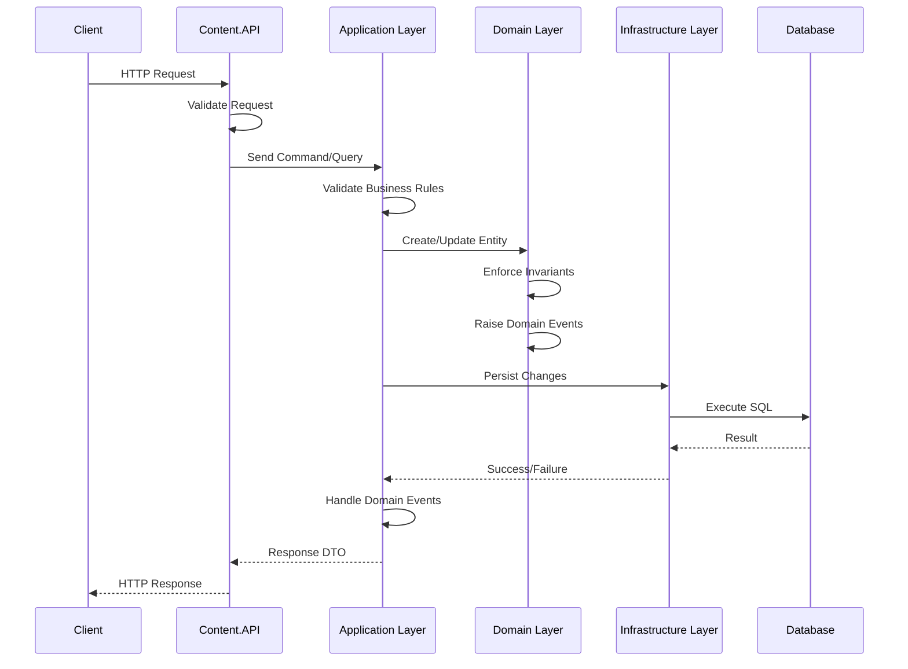
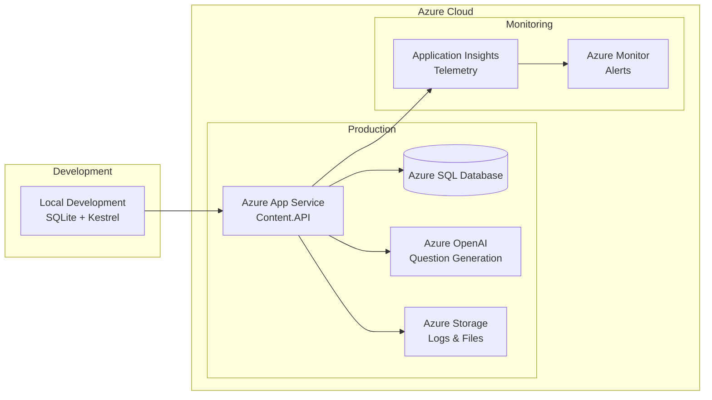

# Wisgenix - High-Level Design Document

## System Overview

Wisgenix is a content management system for educational assessments built using Clean Architecture principles with Domain-Driven Design (DDD). The system manages subjects, topics, questions, and integrates with Azure AI for intelligent content generation.

## High-Level Architecture



## Component Responsibilities

### 1. Presentation Layer

#### Content.API
- **Primary Responsibility**: HTTP request/response handling and API contract management
- **Key Functions**:
  - RESTful endpoint exposure (`/api/content/subjects`, `/api/content/topics`, etc.)
  - Request validation and model binding
  - Authentication and authorization
  - HTTP status code management
  - OpenAPI/Swagger documentation
  - Global exception handling middleware
  - CORS configuration
  - Structured logging with correlation IDs

### 2. Application Layer

#### Content.Application
- **Primary Responsibility**: Business workflow orchestration and external interface adaptation
- **Key Functions**:
  - **CQRS Implementation**: Commands for writes, Queries for reads
  - **MediatR Integration**: Decoupled request handling
  - **Input Validation**: FluentValidation for external requests
  - **Object Mapping**: AutoMapper for DTO transformations
  - **Transaction Management**: Unit of Work coordination
  - **External Service Integration**: Azure AI service calls

**Key Patterns**:
- Command/Query Separation
- Handler Pattern
- DTO Pattern
- Validation Pipeline

### 3. Domain Layer

#### Content.Domain
- **Primary Responsibility**: Core business logic and domain rules enforcement
- **Key Functions**:
  - **Rich Domain Entities**: Subject, Topic, Question, QuestionOption
  - **Value Objects**: Encapsulated validation and business rules
  - **Domain Events**: Decoupled side effects
  - **Business Rules**: Invariant enforcement
  - **Domain Services**: Complex business operations
  - **Specifications**: Query logic encapsulation

**Key Entities**:
```mermaid
classDiagram
    class Subject {
        +SubjectName SubjectName
        +IReadOnlyCollection~Topic~ Topics
        +Subject(subjectName)
        +UpdateSubjectName(name)
        +AddTopic(topic)
    }
    
    class Topic {
        +TopicName TopicName
        +int SubjectId
        +IReadOnlyCollection~Question~ Questions
        +Topic(topicName, subjectId)
        +AddQuestion(question)
    }
    
    class Question {
        +QuestionText QuestionText
        +int TopicId
        +DifficultyLevel Difficulty
        +MaxScore Score
        +IReadOnlyCollection~QuestionOption~ Options
    }
    
    class QuestionOption {
        +OptionText OptionText
        +int QuestionId
        +bool IsCorrect
    }
    
    Subject ||--o{ Topic : contains
    Topic ||--o{ Question : contains
    Question ||--o{ QuestionOption : has
```

### 4. Infrastructure Layer

#### Content.Infrastructure
- **Primary Responsibility**: External system integration and data persistence
- **Key Functions**:
  - **Repository Implementation**: Data access abstraction
  - **Entity Framework Configuration**: Database mapping
  - **Unit of Work**: Transaction boundary management
  - **External Service Clients**: Azure AI integration
  - **Database Migrations**: Schema evolution

### 5. Cross-Cutting Concerns

#### Wisgenix.SharedKernel
- **Primary Responsibility**: Common patterns and base functionality
- **Key Functions**:
  - Base entity classes with audit trails
  - Domain event infrastructure
  - Common interfaces and abstractions
  - Validation patterns
  - Exception hierarchy

## Data Flow Architecture



## Technology Stack

| Layer | Technologies |
|-------|-------------|
| **Presentation** | ASP.NET Core 9.0, Swagger/OpenAPI |
| **Application** | MediatR, FluentValidation, AutoMapper |
| **Domain** | .NET 9.0, Domain Events |
| **Infrastructure** | Entity Framework Core, SQL Server/SQLite |
| **Cross-Cutting** | Serilog, Correlation IDs |
| **Testing** | xUnit, Moq, FluentAssertions |

## Quality Attributes

### Maintainability
- **Clean Architecture**: Clear separation of concerns
- **SOLID Principles**: Dependency inversion, single responsibility
- **DDD Patterns**: Rich domain models, ubiquitous language

### Testability
- **Dependency Injection**: All dependencies are injected
- **Interface Segregation**: Small, focused interfaces
- **Repository Pattern**: Data access abstraction

### Scalability
- **CQRS**: Read/write separation for independent scaling
- **Event-Driven**: Loose coupling through domain events
- **Stateless Design**: No server-side session state

### Reliability
- **Global Exception Handling**: Consistent error responses
- **Structured Logging**: Comprehensive audit trail
- **Transaction Management**: Data consistency guarantees

## Security Considerations

- **Input Validation**: Multiple validation layers
- **SQL Injection Prevention**: Parameterized queries via EF Core
- **CORS Configuration**: Controlled cross-origin access
- **Authentication Ready**: Extensible for OAuth/JWT integration

## Deployment Architecture



This high-level design provides a solid foundation for a maintainable, scalable, and testable content management system following industry best practices and clean architecture principles.
