# Wisgenix - Low-Level Design Document

## Component-Level Architecture

### 1. Content.API - Presentation Layer

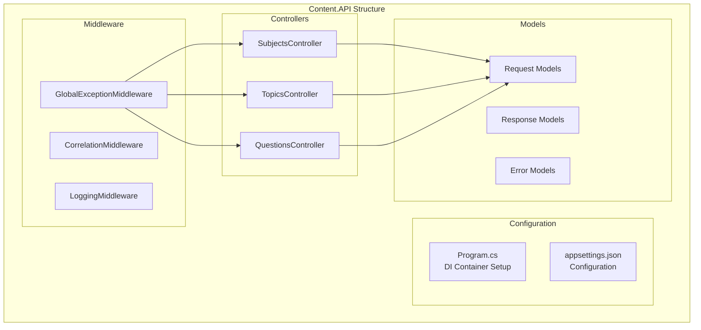

#### Controller Design Pattern

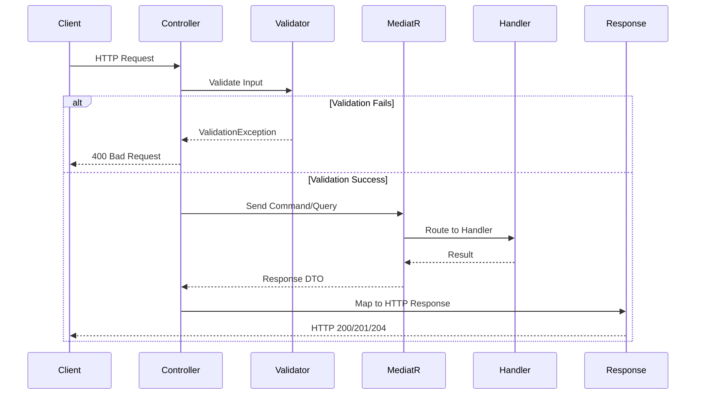

#### Key Responsibilities
- **HTTP Protocol Handling**: Request/response lifecycle management
- **Input Validation**: Basic format and required field validation
- **Command/Query Dispatching**: MediatR integration
- **Response Formatting**: Consistent API response structure
- **Error Handling**: HTTP status code mapping
- **Documentation**: OpenAPI/Swagger integration

### 2. Content.Application - Application Layer

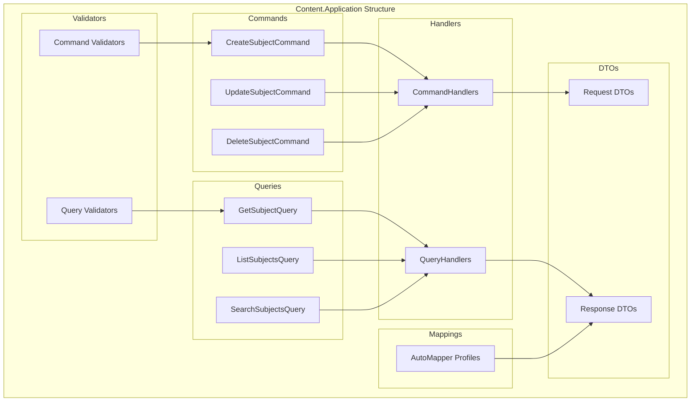

#### CQRS Implementation Pattern

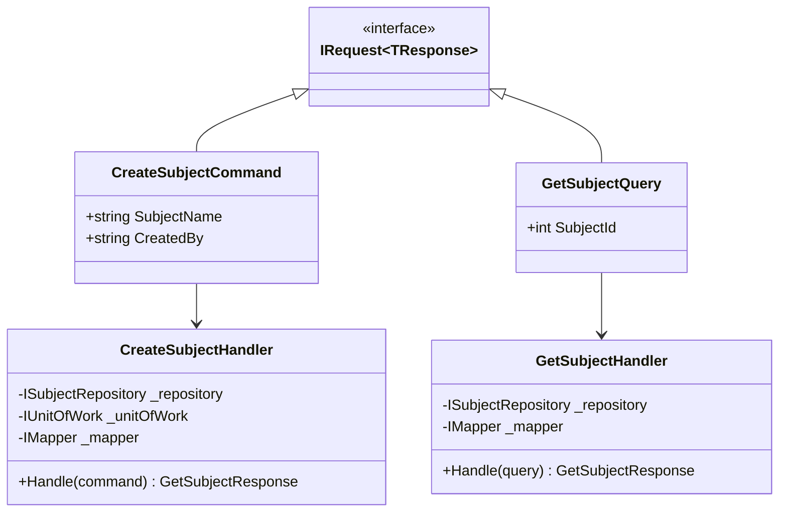

#### Key Responsibilities
- **Business Workflow Orchestration**: Coordinate domain operations
- **External Interface Adaptation**: Convert external requests to domain operations
- **Transaction Management**: Unit of Work coordination
- **Validation Pipeline**: FluentValidation integration
- **Object Mapping**: DTO to domain entity transformation
- **Event Handling**: Domain event processing

### 3. Content.Domain - Domain Layer

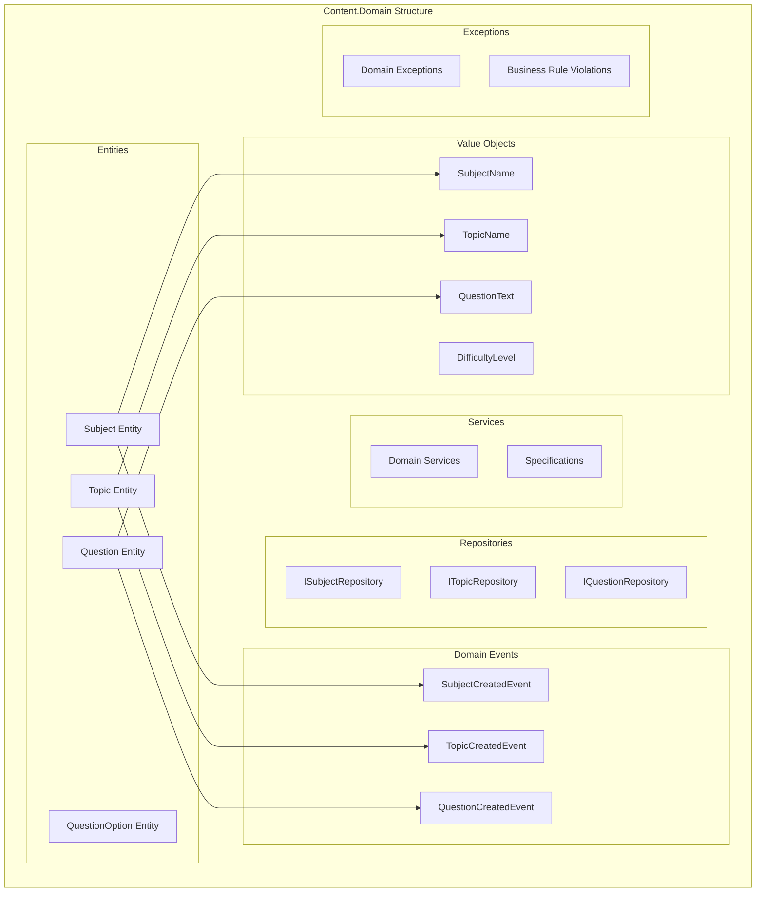

#### Rich Domain Entity Pattern

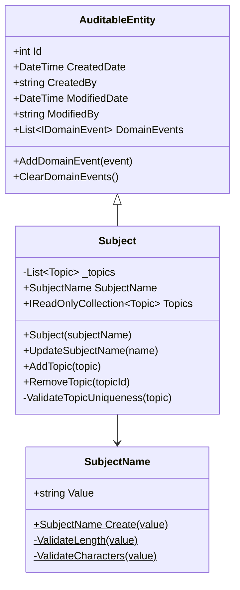

#### Domain Event Pattern

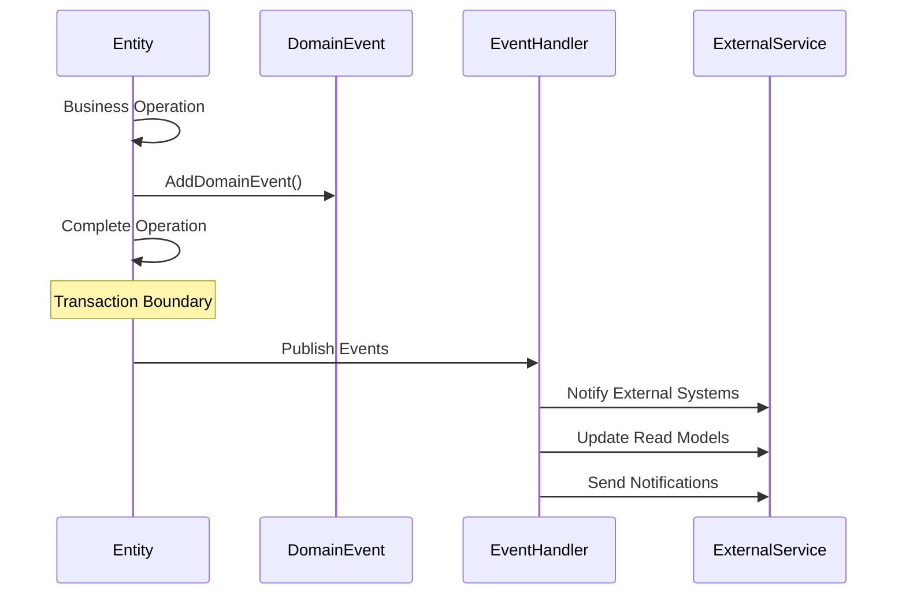

#### Key Responsibilities
- **Business Logic Encapsulation**: Core business rules and invariants
- **Data Integrity**: Entity validation and consistency
- **Domain Events**: Side effect coordination
- **Rich Behavior**: Methods that operate on entity data
- **Invariant Protection**: Prevent invalid state transitions

### 4. Content.Infrastructure - Infrastructure Layer

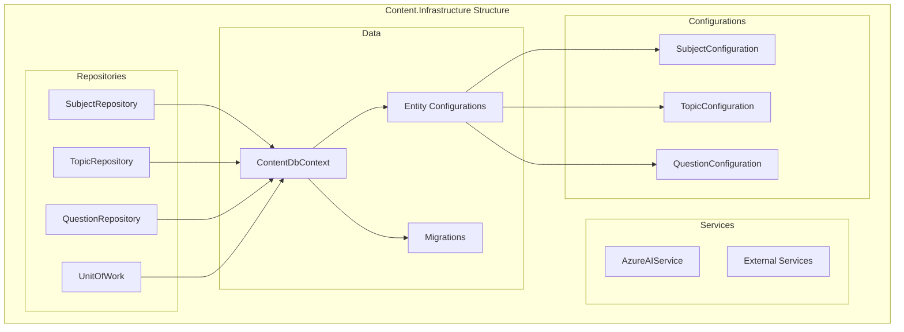

#### Repository Implementation Pattern

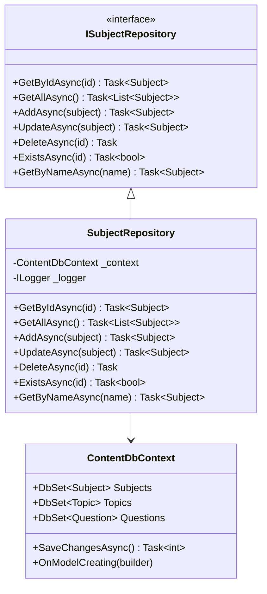

#### Entity Framework Configuration Pattern

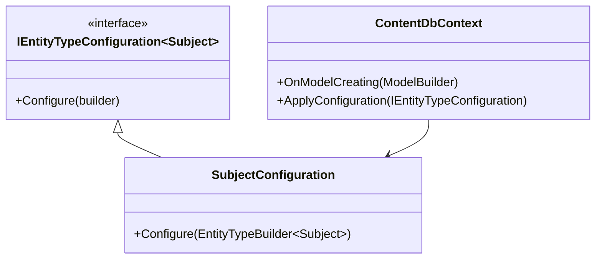

#### Key Responsibilities
- **Data Persistence**: Entity Framework Core integration
- **Query Optimization**: Efficient data retrieval
- **Transaction Management**: Unit of Work implementation
- **External Service Integration**: Azure AI, third-party APIs
- **Database Schema Management**: Migrations and configurations

## Inter-Component Communication

### Request Flow Architecture

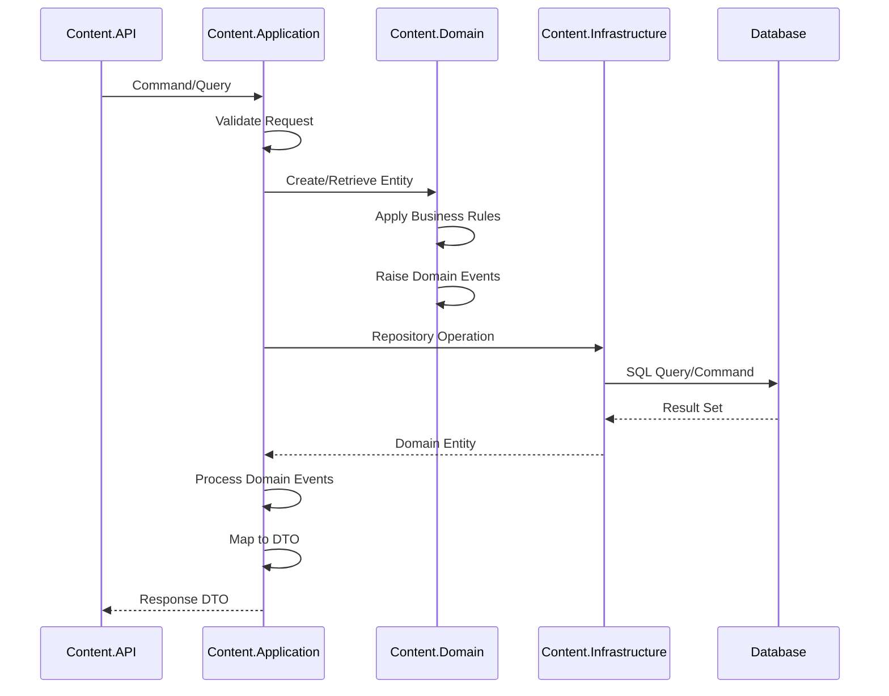

### Dependency Flow

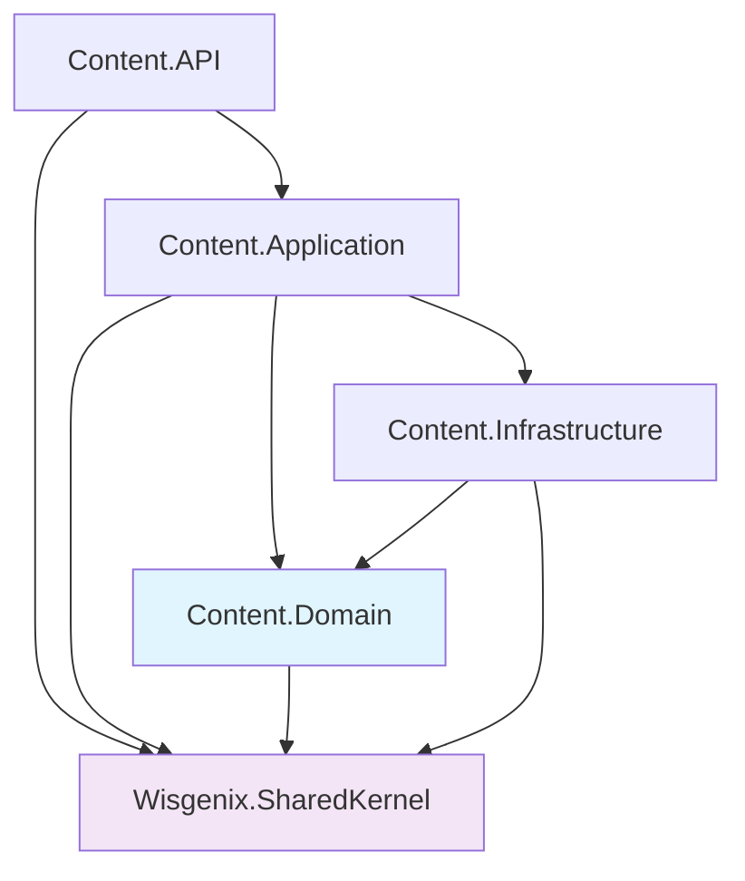

## Error Handling Strategy

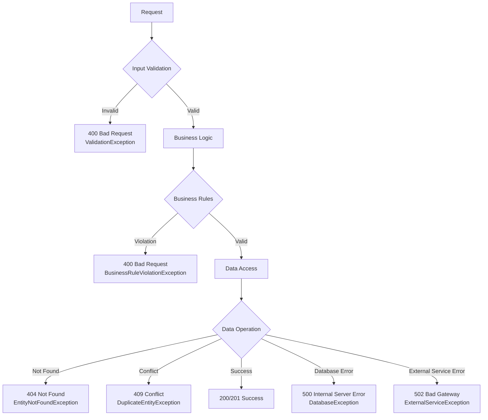

## Performance Considerations

### Query Optimization
- **Eager Loading**: Include related entities when needed
- **Projection**: Select only required fields for DTOs
- **Pagination**: Implement efficient paging for large datasets
- **Caching**: Repository-level caching for frequently accessed data

### Memory Management
- **Dispose Pattern**: Proper resource cleanup
- **Async/Await**: Non-blocking I/O operations
- **Connection Pooling**: Efficient database connection usage

This low-level design provides detailed implementation guidance for each component while maintaining clean architecture principles and ensuring proper separation of concerns.
