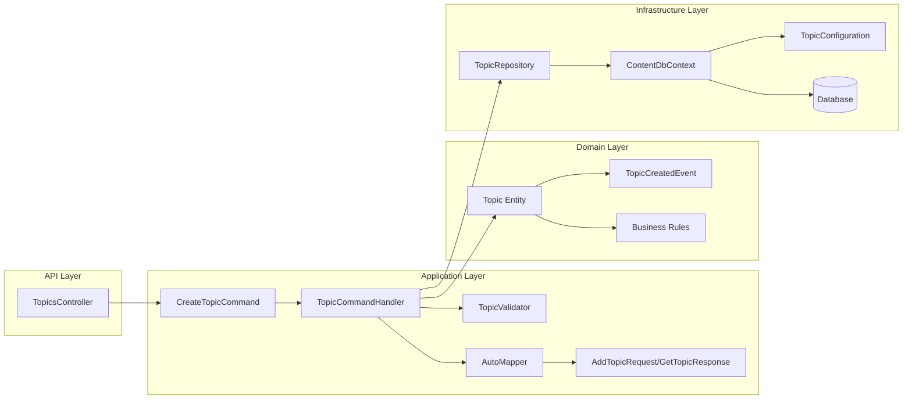
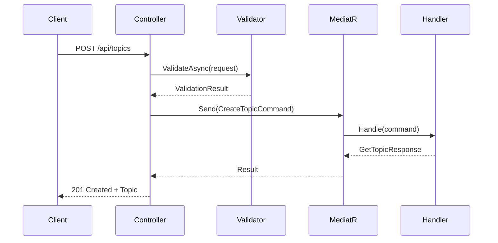
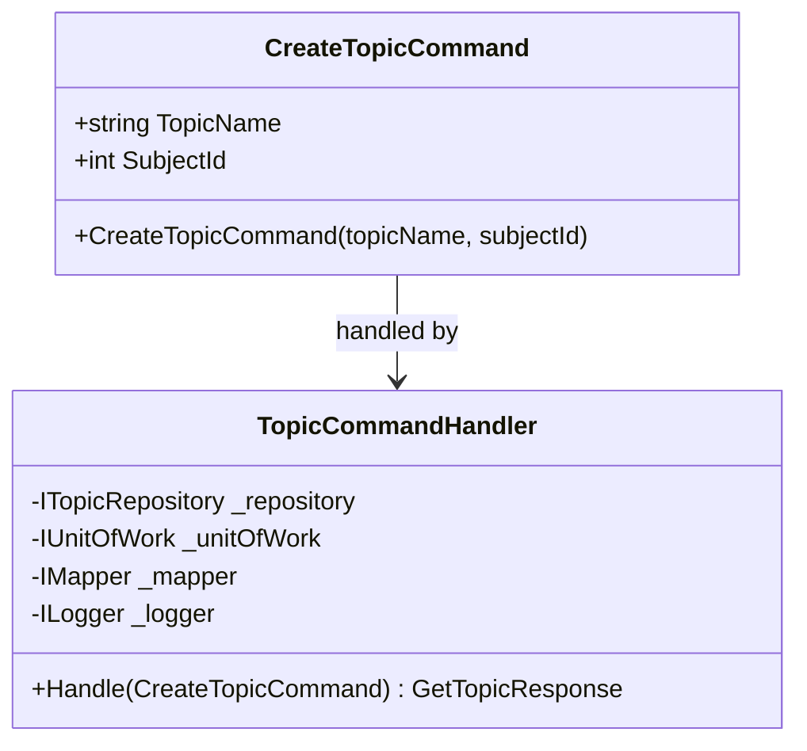
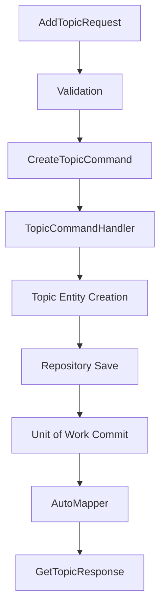
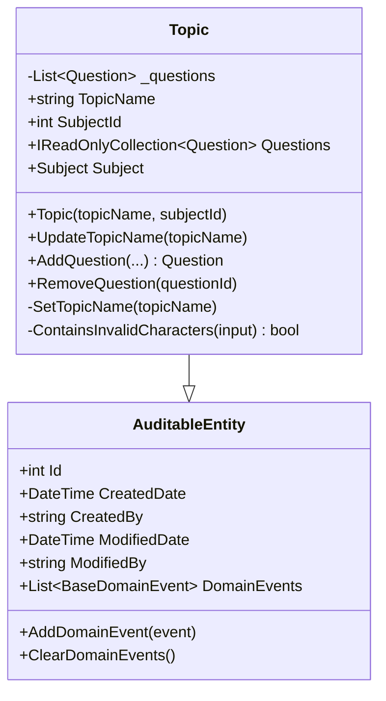
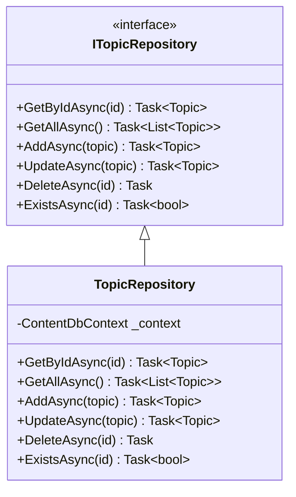
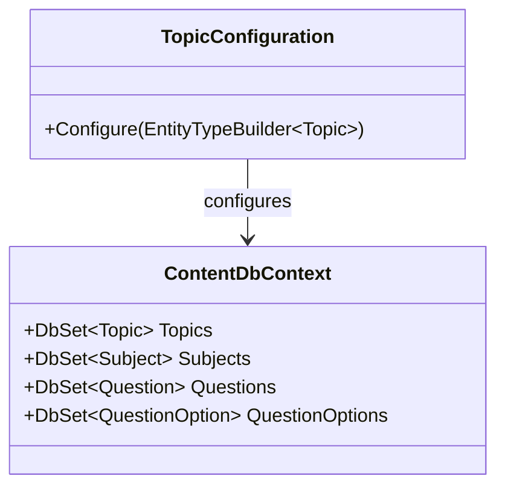
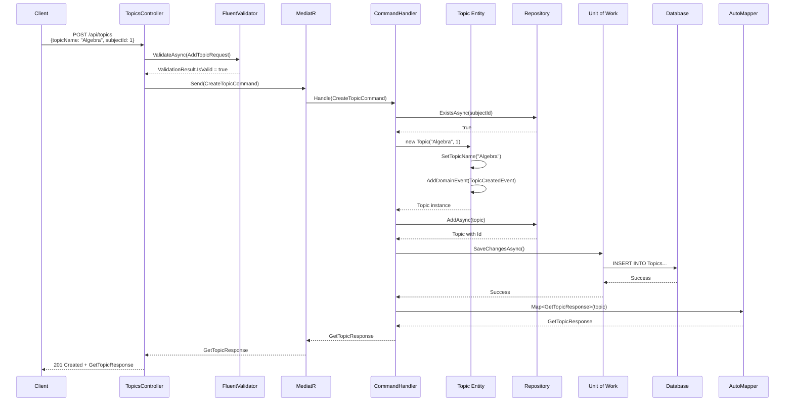
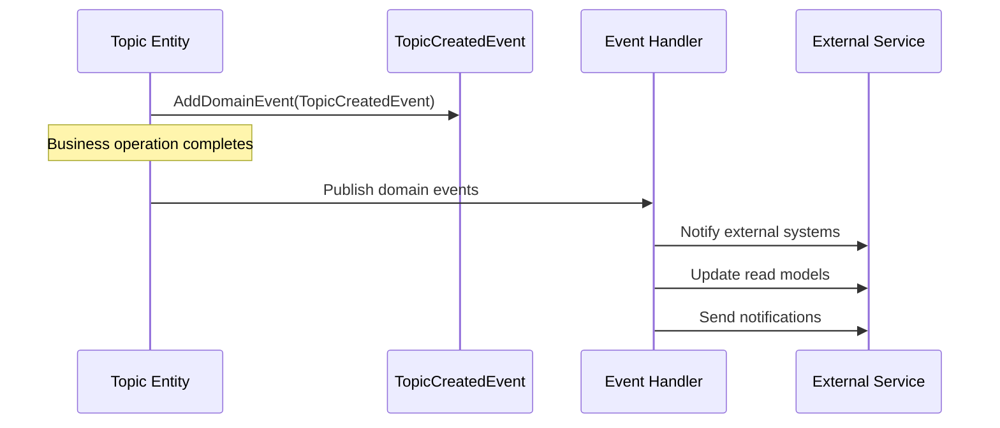
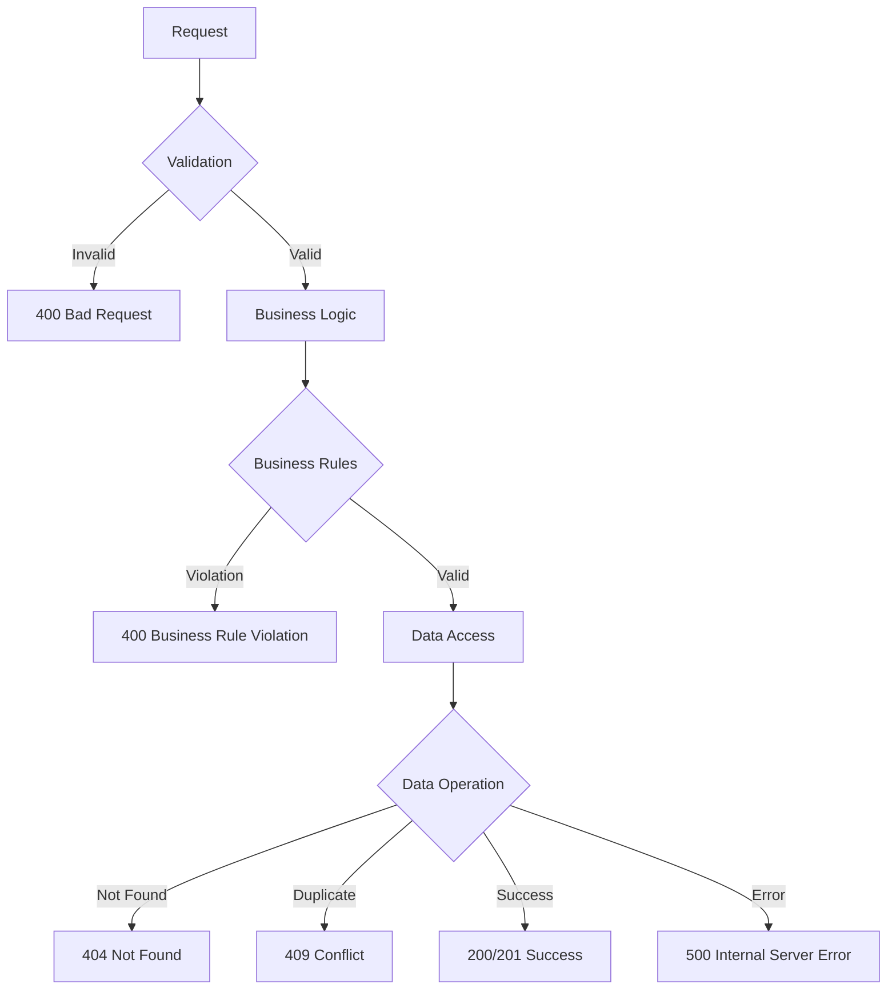

# Topic Entity - End-to-End Flow Documentation

## Component Design Overview

## Detailed Component Breakdown

### 1. **API Controller** (`Content.API/Controllers/TopicsController.cs`)

**Responsibilities:**
- HTTP request/response handling
- Input validation
- Command dispatching via MediatR
- HTTP status code management

### 2. **Application Layer Components**

#### Command Pattern

#### Data Flow

### 3. **Domain Entity** (`Content.Domain/Entities/Topic.cs`)

**Business Rules Enforced:**
- Topic name cannot be empty or whitespace
- Topic name cannot exceed 200 characters
- Topic name cannot contain invalid characters (`<`, `>`, `&`, `"`, `'`)
- No duplicate questions within a topic (case-insensitive)

### 4. **Infrastructure Layer**

#### Repository Pattern

#### Entity Framework Configuration

## Complete Request Flow Example

### Creating a New Topic

## Domain Events Flow

## Error Handling Strategy

This architecture ensures:
- **Separation of Concerns**: Each layer has distinct responsibilities
- **Testability**: Dependencies are injected and can be mocked
- **Maintainability**: Clean boundaries between layers
- **Scalability**: CQRS pattern allows independent scaling
- **Domain-Driven Design**: Rich domain models with business logic
- **Event-Driven Architecture**: Domain events for loose coupling