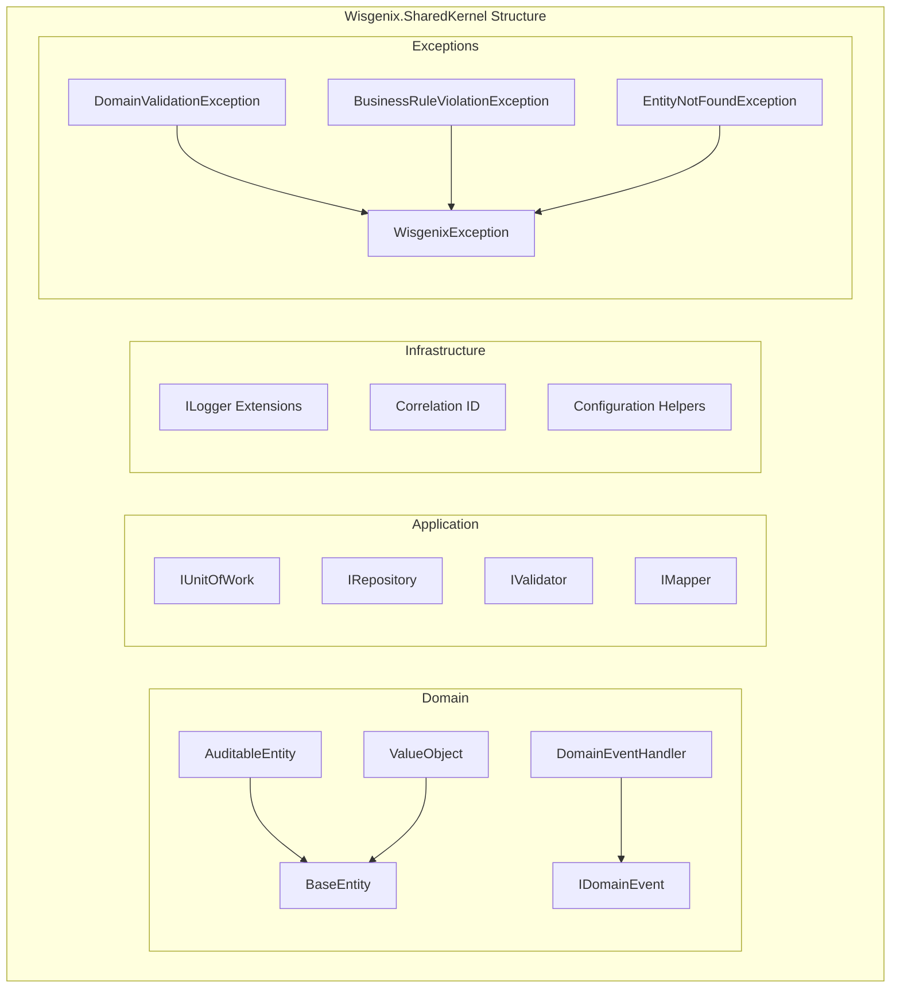

# Wisgenix.SharedKernel - Developer Guide

## Overview

The `Wisgenix.SharedKernel` is a foundational library that provides common patterns, base classes, and cross-cutting concerns used across all bounded contexts in the Wisgenix application. It implements Domain-Driven Design (DDD) patterns and Clean Architecture principles.

## Architecture



## Core Components

### 1. Domain Base Classes

#### BaseEntity
Foundation for all domain entities with identity and domain events.

```csharp
public abstract class BaseEntity
{
    public int Id { get; protected set; }
    
    private readonly List<IDomainEvent> _domainEvents = new();
    public IReadOnlyCollection<IDomainEvent> DomainEvents => _domainEvents.AsReadOnly();
    
    protected void AddDomainEvent(IDomainEvent domainEvent)
    {
        _domainEvents.Add(domainEvent);
    }
    
    public void ClearDomainEvents()
    {
        _domainEvents.Clear();
    }
    
    // Equality implementation based on Id
    public override bool Equals(object? obj) { /* Implementation */ }
    public override int GetHashCode() { /* Implementation */ }
}
```

**Usage Example:**
```csharp
public class Subject : AuditableEntity
{
    public Subject(string subjectName)
    {
        SubjectName = SubjectName.Create(subjectName);
        AddDomainEvent(new SubjectCreatedEvent(Id, SubjectName.Value));
    }
}
```

#### AuditableEntity
Extends BaseEntity with audit trail functionality.

```csharp
public abstract class AuditableEntity : BaseEntity
{
    public DateTime CreatedDate { get; set; }
    public string CreatedBy { get; set; } = string.Empty;
    public DateTime ModifiedDate { get; set; }
    public string ModifiedBy { get; set; } = string.Empty;
}
```

**Usage Example:**
```csharp
public class Topic : AuditableEntity
{
    // Audit fields are automatically populated by EF Core interceptors
    public TopicName TopicName { get; private set; }
    public int SubjectId { get; private set; }
}
```

#### ValueObject
Base class for implementing value objects with proper equality semantics.

```csharp
public abstract class ValueObject
{
    protected abstract IEnumerable<object> GetEqualityComponents();
    
    public override bool Equals(object? obj)
    {
        if (obj == null || obj.GetType() != GetType())
            return false;
            
        var other = (ValueObject)obj;
        return GetEqualityComponents().SequenceEqual(other.GetEqualityComponents());
    }
    
    public override int GetHashCode()
    {
        return GetEqualityComponents()
            .Select(x => x?.GetHashCode() ?? 0)
            .Aggregate((x, y) => x ^ y);
    }
}
```

**Usage Example:**
```csharp
public class SubjectName : ValueObject
{
    public string Value { get; private set; }
    
    private SubjectName(string value) => Value = value;
    
    public static SubjectName Create(string value)
    {
        if (string.IsNullOrWhiteSpace(value))
            throw new DomainValidationException("Subject name cannot be empty");
            
        return new SubjectName(value.Trim());
    }
    
    protected override IEnumerable<object> GetEqualityComponents()
    {
        yield return Value;
    }
    
    public static implicit operator string(SubjectName subjectName) => subjectName.Value;
}
```

### 2. Domain Events

#### IDomainEvent Interface
Marker interface for all domain events.

```csharp
public interface IDomainEvent : INotification
{
    DateTime OccurredOn { get; }
}
```

#### BaseDomainEvent
Base implementation for domain events.

```csharp
public abstract class BaseDomainEvent : IDomainEvent
{
    public DateTime OccurredOn { get; } = DateTime.UtcNow;
    public Guid EventId { get; } = Guid.NewGuid();
}
```

**Usage Example:**
```csharp
public class SubjectCreatedEvent : BaseDomainEvent
{
    public int SubjectId { get; }
    public string SubjectName { get; }
    
    public SubjectCreatedEvent(int subjectId, string subjectName)
    {
        SubjectId = subjectId;
        SubjectName = subjectName;
    }
}

// Event Handler
public class SubjectCreatedEventHandler : INotificationHandler<SubjectCreatedEvent>
{
    public async Task Handle(SubjectCreatedEvent notification, CancellationToken cancellationToken)
    {
        // Handle side effects (logging, notifications, etc.)
    }
}
```

### 3. Exception Hierarchy

#### Base Exception
```csharp
public abstract class WisgenixException : Exception
{
    public string ErrorCode { get; }
    public object[] Parameters { get; }
    
    protected WisgenixException(string errorCode, string message, params object[] parameters) 
        : base(message)
    {
        ErrorCode = errorCode;
        Parameters = parameters;
    }
}
```

#### Domain Exceptions
```csharp
public class DomainValidationException : WisgenixException
{
    public DomainValidationException(string message) 
        : base("DOMAIN_VALIDATION_ERROR", message) { }
}

public class BusinessRuleViolationException : WisgenixException
{
    public BusinessRuleViolationException(string message) 
        : base("BUSINESS_RULE_VIOLATION", message) { }
}

public class EntityNotFoundException : WisgenixException
{
    public EntityNotFoundException(string entityName, object id) 
        : base("ENTITY_NOT_FOUND", $"{entityName} with id {id} was not found") { }
}
```

**Usage Example:**
```csharp
public class Subject : AuditableEntity
{
    public void UpdateSubjectName(string subjectName)
    {
        if (string.IsNullOrWhiteSpace(subjectName))
            throw new DomainValidationException("Subject name cannot be empty");
            
        SubjectName = SubjectName.Create(subjectName);
    }
}
```

### 4. Repository Interfaces

#### Generic Repository Interface
```csharp
public interface IRepository<T> where T : BaseEntity
{
    Task<T?> GetByIdAsync(int id, CancellationToken cancellationToken = default);
    Task<List<T>> GetAllAsync(CancellationToken cancellationToken = default);
    Task<T> AddAsync(T entity, CancellationToken cancellationToken = default);
    Task<T> UpdateAsync(T entity, CancellationToken cancellationToken = default);
    Task DeleteAsync(int id, CancellationToken cancellationToken = default);
    Task<bool> ExistsAsync(int id, CancellationToken cancellationToken = default);
}
```

#### Unit of Work Interface
```csharp
public interface IUnitOfWork : IDisposable
{
    Task<int> SaveChangesAsync(CancellationToken cancellationToken = default);
    Task BeginTransactionAsync(CancellationToken cancellationToken = default);
    Task CommitTransactionAsync(CancellationToken cancellationToken = default);
    Task RollbackTransactionAsync(CancellationToken cancellationToken = default);
}
```

**Usage Example:**
```csharp
public class CreateSubjectHandler : IRequestHandler<CreateSubjectCommand, GetSubjectResponse>
{
    private readonly ISubjectRepository _repository;
    private readonly IUnitOfWork _unitOfWork;
    
    public async Task<GetSubjectResponse> Handle(CreateSubjectCommand request, CancellationToken cancellationToken)
    {
        var subject = new Subject(request.SubjectName);
        await _repository.AddAsync(subject, cancellationToken);
        await _unitOfWork.SaveChangesAsync(cancellationToken);
        
        return _mapper.Map<GetSubjectResponse>(subject);
    }
}
```

### 5. Logging Extensions

#### Structured Logging with Correlation IDs
```csharp
public static class LoggerExtensions
{
    public static ILogger WithCorrelationId(this ILogger logger, string correlationId)
    {
        return logger.ForContext("CorrelationId", correlationId);
    }
    
    public static void LogDomainEvent(this ILogger logger, IDomainEvent domainEvent)
    {
        logger.Information("Domain event {EventType} occurred at {OccurredOn} with ID {EventId}",
            domainEvent.GetType().Name,
            domainEvent.OccurredOn,
            domainEvent.EventId);
    }
    
    public static void LogBusinessRuleViolation(this ILogger logger, string rule, object entity)
    {
        logger.Warning("Business rule violation: {Rule} for entity {Entity}",
            rule, entity.GetType().Name);
    }
}
```

**Usage Example:**
```csharp
public class SubjectCommandHandler
{
    private readonly ILogger<SubjectCommandHandler> _logger;
    
    public async Task<GetSubjectResponse> Handle(CreateSubjectCommand request, CancellationToken cancellationToken)
    {
        _logger.LogInformation("Creating subject with name {SubjectName}", request.SubjectName);
        
        try
        {
            var subject = new Subject(request.SubjectName);
            // ... business logic
            
            _logger.LogDomainEvent(new SubjectCreatedEvent(subject.Id, subject.SubjectName));
            return response;
        }
        catch (DomainValidationException ex)
        {
            _logger.LogBusinessRuleViolation(ex.Message, request);
            throw;
        }
    }
}
```

## How to Use SharedKernel

### 1. Adding Reference
```xml
<ProjectReference Include="..\Wisgenix.SharedKernel\Wisgenix.SharedKernel.csproj" />
```

### 2. Creating Domain Entities
```csharp
// Step 1: Create value objects for validation
public class TopicName : ValueObject
{
    public string Value { get; private set; }
    
    public static TopicName Create(string value)
    {
        // Validation logic here
        return new TopicName(value);
    }
    
    protected override IEnumerable<object> GetEqualityComponents()
    {
        yield return Value;
    }
}

// Step 2: Create domain entity
public class Topic : AuditableEntity
{
    public TopicName TopicName { get; private set; }
    public int SubjectId { get; private set; }
    
    public Topic(string topicName, int subjectId)
    {
        TopicName = TopicName.Create(topicName);
        SubjectId = subjectId;
        AddDomainEvent(new TopicCreatedEvent(Id, TopicName.Value, SubjectId));
    }
}
```

### 3. Creating Domain Events
```csharp
public class TopicCreatedEvent : BaseDomainEvent
{
    public int TopicId { get; }
    public string TopicName { get; }
    public int SubjectId { get; }
    
    public TopicCreatedEvent(int topicId, string topicName, int subjectId)
    {
        TopicId = topicId;
        TopicName = topicName;
        SubjectId = subjectId;
    }
}
```

### 4. Implementing Repositories
```csharp
public interface ITopicRepository : IRepository<Topic>
{
    Task<List<Topic>> GetBySubjectIdAsync(int subjectId, CancellationToken cancellationToken = default);
    Task<Topic?> GetByNameAsync(string topicName, CancellationToken cancellationToken = default);
}

public class TopicRepository : ITopicRepository
{
    private readonly ContentDbContext _context;
    
    public async Task<Topic?> GetByIdAsync(int id, CancellationToken cancellationToken = default)
    {
        return await _context.Topics
            .Include(t => t.Subject)
            .FirstOrDefaultAsync(t => t.Id == id, cancellationToken);
    }
    
    // Implement other methods...
}
```

### 5. Exception Handling
```csharp
public class Topic : AuditableEntity
{
    public void UpdateTopicName(string topicName)
    {
        if (string.IsNullOrWhiteSpace(topicName))
            throw new DomainValidationException("Topic name cannot be empty");
            
        if (topicName.Length > 200)
            throw new BusinessRuleViolationException("Topic name cannot exceed 200 characters");
            
        TopicName = TopicName.Create(topicName);
        AddDomainEvent(new TopicUpdatedEvent(Id, TopicName.Value));
    }
}
```

## Best Practices

### 1. Domain Entity Design
- Always inherit from `AuditableEntity` for entities that need audit trails
- Use value objects for validated properties
- Raise domain events for significant business operations
- Keep entities focused on business logic, not data access

### 2. Value Object Usage
- Use for validated, immutable values
- Implement proper equality semantics
- Make creation methods static and validate input
- Use implicit operators for easy conversion

### 3. Domain Events
- Raise events for business-significant operations
- Keep events immutable
- Include relevant data in event properties
- Handle events asynchronously when possible

### 4. Exception Handling
- Use specific exception types for different scenarios
- Include meaningful error messages
- Don't catch and re-throw generic exceptions
- Log exceptions with correlation IDs

### 5. Repository Implementation
- Keep interfaces in domain layer
- Implement in infrastructure layer
- Use async/await for all database operations
- Include related entities when needed

The SharedKernel provides a solid foundation for building maintainable, testable, and consistent domain-driven applications across all bounded contexts in the Wisgenix system.